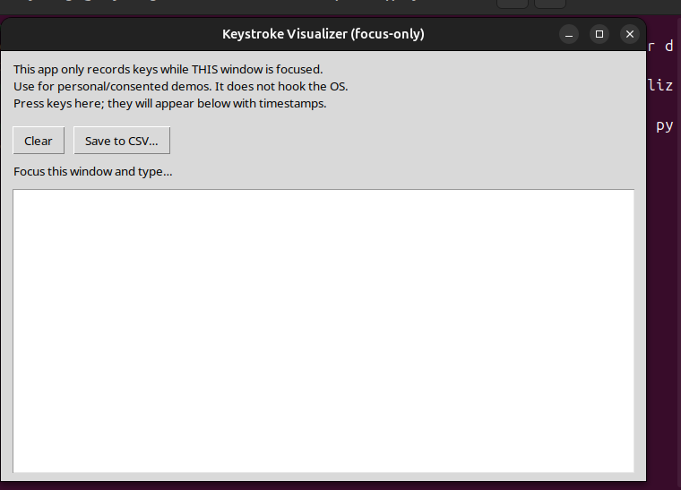

# Keystroke Visualizer (Focus-Only)

A safe demo that shows keyboard events **only while this window is focused**.  
It does **not** hook the OS or capture keystrokes from other apps.

## Why this exists
- Educational purposes (event handling, timing).
- Accessibility/UX prototyping.
- Typing practice with consent.

## Run
```bash
python app.py
nano ~/Desktop/keystroke-visualizer/README.md
# keystroke-visualizer
